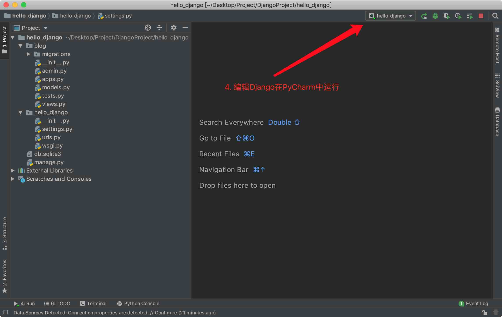

# 创建项目
**命令行创建Django项目方法**

* 创建python虚拟环境：`mkvirtualenv DjangoProject`
* 启动虚拟环境DjangoProject项目方法：`workon DjangoProject`   
* 在DjangoProject项目环境安装Django方法：`pip install django`
* 建立一个存放Django项目目录：`mkdir DjangoProject`使用cd进入创建项目目录
* 在存放项目文件执行新建项目命令：`django-admin startproject hello_django`
* 使用命令创建app方法：`django-admin startapp appname`
* 进入项目存放目录使用命令运行Django` python manage.py runserver 0.0.0.0:8000`
-----------------------------------------------------------------------
**PyCharm导入新建Django项目**

-----------------------------------------------------------------------
**PyCharm创建Django项目方法**

