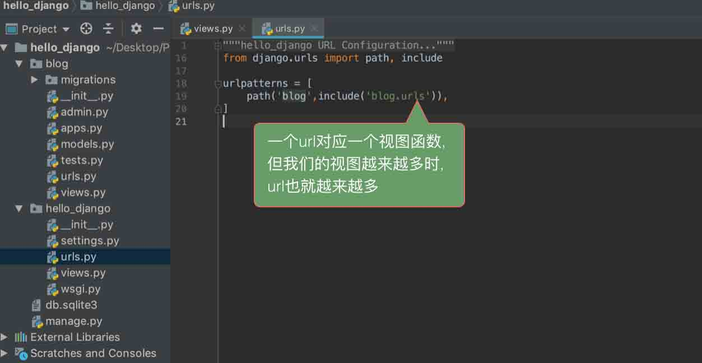

**1. URL概念**

URL（Uniform Resoure Locator）统一资源定位符是对可以从互联网上得到的资源的位置和访问方法的一种简洁的表示，是互联网上标准资源的地址。互联网上的每个文件都有一个唯一的URL，它包含的信息指出文件的位置以及浏览器应该怎么处理它。

**2. URL格式**

http://127.0.0.1:8000/hello/

**URL解释:**

* schema://host[:port#]/path/.../[?query-string][#anchor]
* schema：指定使用的协议(例如：http, https, ftp)
* host：Http服务器的IP地址或者域名
* port：端口号，http默认是80端口
* path：访问资源的路径
* query-string：发送给http服务器的数据
* anchor：锚点

**3. urls.py作用**

URL配置（URLconf）就像是Django所支撑网站的目录。它的本质是URL模式以及要为该URL模式调用的视图函数之间的映射表。以这样的方式告诉Django，对于那个URL调用那段代码。url的加载就是从配置文件中开始

**URL例子：path 与 re_path**
```
from django.contrib import admin
from django.urls import path, re_path
from .views import test1,test2,test3

urlpatterns = [
    path('admin/', admin.site.urls),
    path('test1/django',test1),
    path('test2/<python>/',test2),
    path('test3/<int:age>/',test3), #int转换器控制只能输入数字

    #re_path('taka',taka1), #路由地址只要包含taka就可以匹配
    re_path('^taka/$',taka1), #路由地址精确匹配只包含taka匹配
    re_path('^taka/(?P<age>[0-9]+)/$',taka2),
]
```
**在项目目录创建一个views.py文件**
```
from django.http import HttpResponse


def test1(request):
    return HttpResponse('hello django!!!')

def test2(request,python):
    return HttpResponse('hello %s'%python)

def test3(request,age):
    return HttpResponse('hello %s'%age)

def taka1(request):
    return HttpResponse('hello') #这个方法在路由地址前后输入信息都可以匹配

def taka2(request,age):
    return HttpResponse('hello %s'%age)    
```
**4. URL分析**


**5. path 基本规则**


**6. 默认支持的转换器**

* str,匹配除了路径分隔符（/）之外的非空字符串，这是默认的形式
* int,匹配正整数，包含0。
* slug,匹配字母、数字以及横杠、下划线组成的字符串。
* uuid,匹配格式化的uuid，如 075194d3-6885-417e-a8a8-6c931e272f00。
* path,匹配任何非空字符串，包含了路径分隔符

转换器的使用

-------------------------------------------------------------------------
**include的作用**

* 一个project有一个总的urls.py
* 各个app也可以自己建立自己的urls.py
* 用include()函数在project的urls.py文件进行注册



**include例子:**

项目目录下的urls.py
```
from django.urls import path, include #进入include模块
from . import views

urlpatterns = [
path('blog/', include('blog.urls')),
]
```

APP blog里面的urls.py
```
from django.urls import path
from . import views

urlpatterns = [
    path('/index/', views.index), # /index/必须在index前面加上/做拼接
]
```

APP blog里面的views.py
```
from django.http import HttpResponse

def index(request):
    return HttpResponse('这个是blog的首页！！')
```

**kwargs的作用**

* **传递一个Python 字典作为额外的参数传递给视图函数。**

主urls.py文件
```
from django.urls import path, include

urlpatterns = [
    path('blog/', include('blog.urls'),{'switch':'true'}),
]
```

* **视图函数中可以通过关键字参数获取到**

APP blog里面的views.py
```
from django.http import HttpResponse
import datetime

def index(request, **kwargs):
    if kwargs.get('switch') == 'true':
        print(datetime.datetime.now())
    return HttpResponse('这个blog的首页！！')
```
Kwargs为字典类型可以传递额外的参数到views中使用include的时候需要统一给下面的url一些参数的时候显得尤其有用

**name的作用**

* 给一个匹配的url地址取名字
* 一般用于模板,也可以使用reverse进行页面重定向


name参数可以给这个url取一个合适的名字。通过给url取名字，以后在view或者模板中使用这个URL，就只需要通过这个名字就可以了。这样做的原因是防止url的规则更改，会导致其他地方用了这个url的地方都需要更改，但是如果取名字了，就不要做任何改动了。
