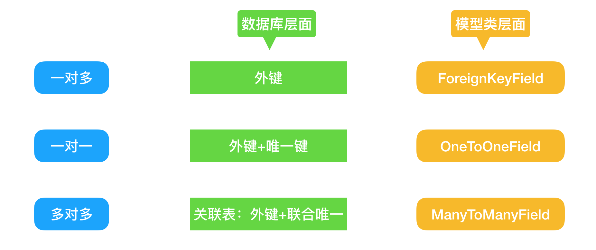

# 一 ORM
* Django的ORM简介
* 数据库连接配置
* 模型的创建与映射
* 数据的增删改查

-------------------------------------------------
# 二 ORM系统分析


* ORM概念:对象关系映射（Object Relational Mapping,简称ORM）
* ORM的优势:不用直接编写SQL代码，只需像操作对象一样从数据库操作数据

-------------------------------------------------
# 三 模型映射关系


* 模型类必须都写在app下的models.py文件中。
* 模型如果需要映射到数据库,所在的app必须被安装。
* 一个数据表对应一个模型类,表中的字段,对应模型中的类属性。

-------------------------------------------------
# 四 数据库的配置
在settings.py中配置DATABASES
```
DATABASES = {
    'default': {
        'ENGINE': 'django.db.backends.mysql', # 数据库引擎
        'NAME': 'mydb', # 数据库名称
        'USER': 'admin', # 链接数据库的用户名
        'PASSWORD': 'Root110qwe', # 链接数据库的密码
        'HOST': '127.0.0.1', # mysql服务器的域名和ip地址
        'PORT': '3306', # mysql的一个端口号,默认是3306
        }
    }
```
1.**数据库驱动安装**

* 在虚拟环境中安装pymysql`pip install pymysql`
* 在虚拟环境中安装Pillow `pip install Pillow`

2.**设置连接器为pymysql**

在主目录下的的__init__.py文件添加下面两句
```
import pymysql
pymysql.install_as_MySQLdb()
```
3.**使用Django中的模型**

在app下面的models.py中创建django模型类
```
from django.db import models

class User(models.Model):
        id = models.AutoField(primary_key=True) #主键可以省略，django会自动给我们加上
        name =models.CharField(max_length=30)
        age = models.IntegerField()
```
4.**将模型类映射到数据库**

1. 执行`python manage.py makemigrations`该命令，创建映射数据库文件。

2. 执行`python manage.py migrate <appname>`该命令，提交到数据库。


# 五 启动项目报以下错误处理方法
```
django2.2/mysql ImproperlyConfigured: mysqlclient 1.3.13 or newer is required; you have 0.9.3
```

1.**解决方法**

Django连接MySQL时默认使用MySQLdb驱动，但MySQLdb不支持Python3，因此这里将MySQL驱动设置为pymysql.

2.**仍使用django 2.2版本**
```
#找到Python环境下 django包，并进入到backends下的mysql文件夹
cd /opt/anaconda3/envs/envAGC_Mini/lib/python3.6/site-packages/django/db/backends/mysql
#文件列表如下

找到base.py文件，注释掉 base.py 中如下部分（35/36行）
if version < (1, 3, 3):
raise ImproperlyConfigured("mysqlclient 1.3.3 or newer is required; you have %s" % Database.__version__)
```
此时仍会会报错，报错信息如下
```
AttributeError: ‘str’ object has no attribute ‘decode’
```
3.**解决办法**
```
#找到operations.py文件（46行），将decode改为encode
#linux vim 查找快捷键：？decode
if query is not None:
    query = query.decode(errors='replace')
    return query
#改为
if query is not None:
    query = query.encode(errors='replace')
    return query
```
# 六 增删改查
在views.py文件内执行增删改查
```
from django.http import HttpResponse
from .models import User

#增加数据
def add_user(request):
    #第一种方法
    # taka = User(name='zlk', age = 18)
    # taka.save()
    #第二种方法
    # budong = User()
    # budong.name = 'budong'
    # budong.age = 18
    # budong.save()
    #第三种方法
    # User.objects.create(name='leva',age=18)
    #第四种方法 添加数据会判断数据是否存在，若存在不添加，不存在就添加
    #User.objects.get_or_create(name='vip',age=19)

    return HttpResponse('数据添加成功')

#查询数据
def search_user(request):
    #查询所有记录
    # rs =User.objects.all()
    #获取第一条数据
    # rs =User.objects.first()
    #获取最后一条数据
    # rs = User.objects.last()
    #根据参数提供的条件过滤后的记录
    # rs = User.objects.filter(name='zlk',age=18)
    #注意：filter（**kwargs）方法：根据参数提供的提取条件，获取一个过滤后的QuerySet。
    # print(rs[2]) #一个模型的实例，数据表的一条数据
    #查询某一个记录，返回一个对象
    #rs = User.objects.get(id=3) #一个实例对象
    return HttpResponse('查询添加成功')

#更新数据
def update_user(request):
    #第一种方法
    # rs = User.objects.get(id=3)
    # rs.name = 'ali'
    # rs.save()
    # print(rs)
    #第二种更新
    # User.objects.filter(name='ali').update(name='zlkvip')
    # User.objects.all().update(city='beijing')

    return HttpResponse('数据更新成功')
#删除数据
def delete_user(request):
    #User.objects.get(id=4).delete()
    #注意：get返回的对象具有唯一性质，如果符合条件的对象有多个，则get报错！
    return HttpResponse('数据删除成功')
```
# 七 常用查询方法
```
from django.http import HttpResponse
from .models import User

def add_user(request):
# 获取所有记录
    rs = User.objects.all()

# 获取第一条数据
    rs = User.objects.first()

# 获取最后一条数据
    rs = User.objects.last()

# 根据参数提供的条件获取过滤后的记录
    rs = User.objects.filter(name='xiaoming')
# 注意：filter（**kwargs）方法：根据参数提供的提取条件，获取一个过滤后的QuerySet。   

# 排除name等于xiaoming的记录
    rs = User.objects.exclude(name='xiaoming')

# 获取一个记录对象
    rs = User.objects.get(name='xiaoming')
# 注意：get返回的对象具有唯一性，如果符合条件的对象有多个，则get报错！

# 对结果排序order_by
    rs = User.objects.order_by('age')

# 多项排序
    rs = User.objects.order_by('age', 'id')

# 逆向拍讯
    rs = User.objects.order_by（'-age'）
# 将返回来的QuerySet中Model转换为字典

# 获取所有值
    rs = User.objects.all().values()

# 获取当前查询到的数据的总数
    rs = User.objcets.count()

    return HttpResponse("查询所有信息")
```
# 八 常用查询条件
查找对象的条件的意思是传给以上方法的一些参数。相当于是SQL语句中的where语句后面的条件，语法为字段名__规则(是连着连个下划线哦)
```
from django.http import HttpResponse
from .models import User

def add_user(request):

# exact相当于等于号
    rs = User.objects.filter(name__exact='xiaoming')

# contains 包含
    rs = User.objects.filter(name__contains='xiao')

# startwith以什么开始,
    rs = User.objects.filter(name__startswith='xiao')

# istartswith 同 startswith相同方法，忽略大小写
    rs = User.objects.filter(name__istartswith='xiao')

# endswith 同 startswith相同用法，以什么结尾
    rs = User.objects.filter(name__endswith='o')

# iendswith 同 istartswith相同用法，以什么结尾，忽略大小写。
    rs = User.objects.filter(name__iendswith='o')

# in 成员所属
    rs = User.objects.filter(age__in=[18,19,20])

# gt大于
    rs = User.objects.filter(age__gt=19)

# gte大于等于
    rs = User.objects.filter(age__gte=19)

# lt小于
    rs = User.objects.filter(age__lt=19)

# lte 小于等于
    rs = User.objects.filter(age__lte=19)

# range 区间
    rs = User.objects.filter(age__range=(18, 20))

# isnull 判断是否为空
    rs = User.objects.filter(city__isnull=True)

return HttpResponse("查询所有信息")
```
# 九 常用的字段类型
1. IntegerField :整型，映射到数据库中的int类型。
2. CharField:字符类型，映射到数据库中的varchar类型，通过max_length指定最大长度。
3. TextField:文本类型，映射到数据库中的text类型。
4. BooleanField:布尔类型，映射到数据库中的tinyint类型，在使用的时候，传递True/False进去。如果要可以为空，则用NullBooleanField。
5. DateField:日期类型，没有时间。映射到数据库中是date类型，在使用的时候，可以设置DateField.auto_now每次保存对象时，自动设置该字段为当前时间。设置DateField.auto_now_add当对象第一次被创建时自动设置当前时间。
6. DateTimeField: 日期时间类型。映射到数据库中的是datetime类型，在使用的时候，传递datetime.datetime()进去。
# 十 Field的常用参数
1. primary_key:指定是否为主键。
2. unique:指定是否唯一。
3. null:指定是否为空，默认为False。
4. blank:等于True时form表单验证时可以为空，默认为False。
5. default:设置默认值。
6. DateField.auto_now:每次修改都会将当前时间更新进去，只有调用，QuerySet.update方法将不会调用。这个参数只是Date和DateTime以及TimModel.save()方法才会调用e类才有的。
7. DateField.auto_now_add:第一次添加进去，都会将当前时间设置进去。以后修改，不会修改这个值
# 十一 表关系实现

