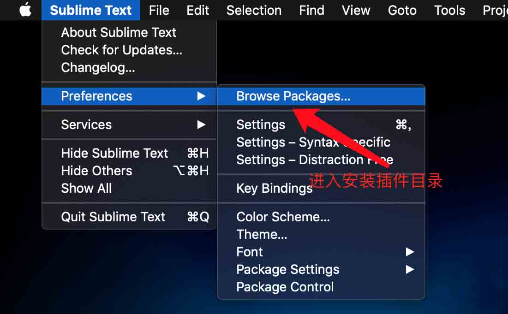
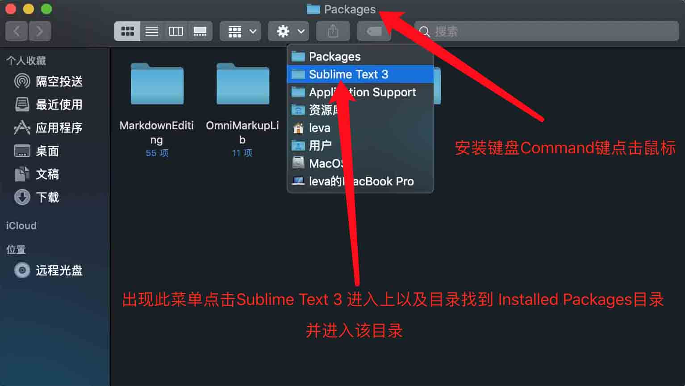
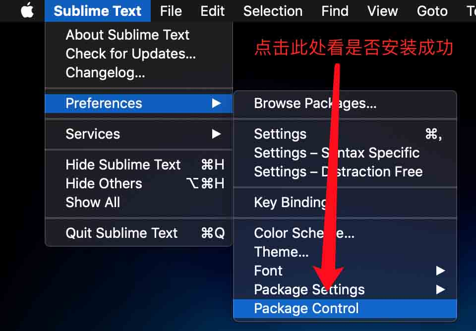

# SublimeText3 for MacOSX PackageControl安装
可能由于各种原因，无法使用代码安装，那可以通过以下步骤手动安装Package Control：
**下载此文件条件必须翻墙方可实现**下载[Package Control.sublime-package](https://packagecontrol.io/Package%20Control.sublime-package)并拷贝到SublimeText3`InstalledPackages`目录下

打开存放插件目录

拷贝PackageControl文件到指定目录

查看PackageControl是否安装成功

