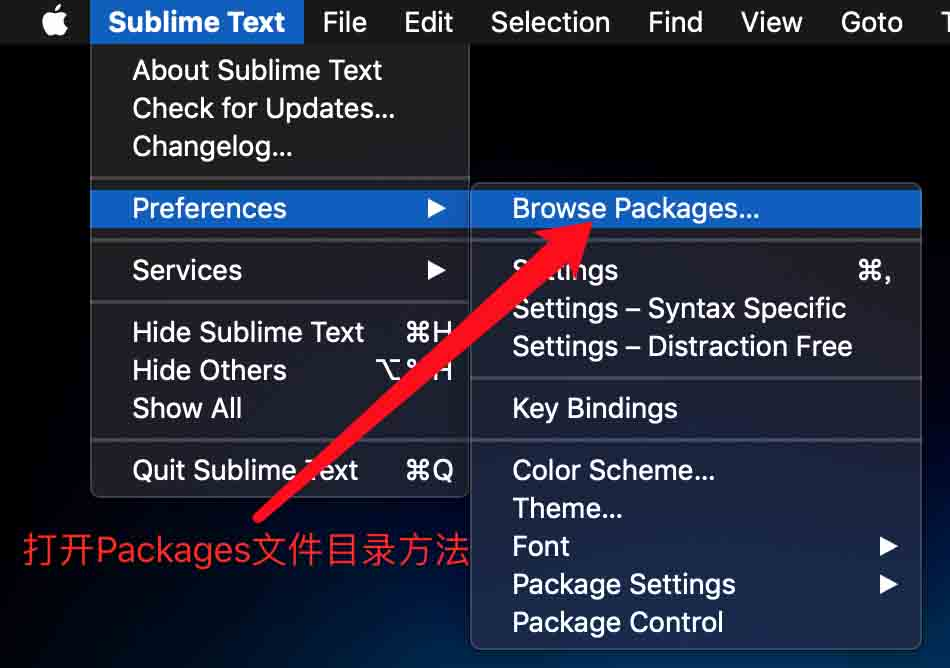
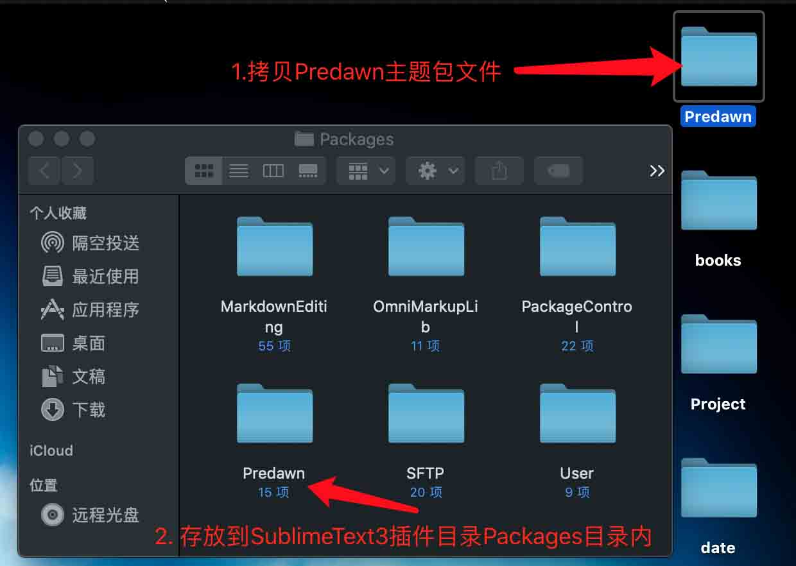
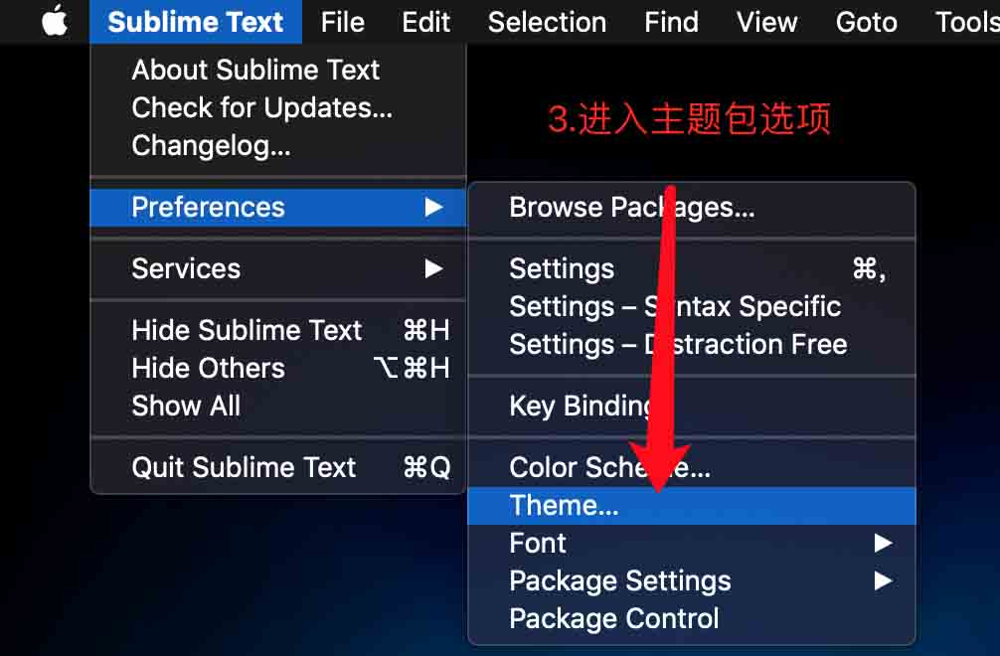
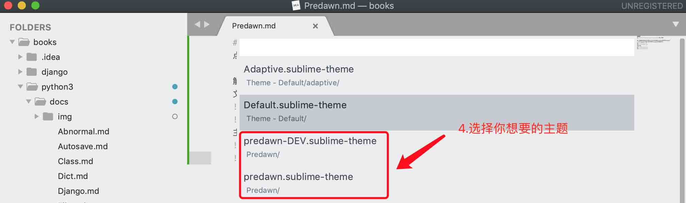

# Sublime Text3 for MacOSX Predawn主题安装
点击[Predawn](https://github.com/jamiewilson/predawn)下载 主题包

解压缩主题包后，需要确定主题包文件名字是`Predawn`拷贝到SublimeText3插件包`Packages`文件夹内即可。打开`Packages`方法如下图,并拷贝`Preadwn`文件到该目录下。

主题包使用方法如下图

