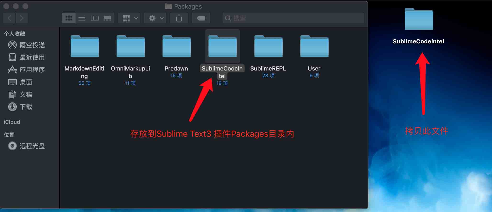

# 代码自动提示/补全插件
去github下载[SublimeCodeIntel](https://github.com/SublimeCodeIntel/SublimeCodeIntel)文件包，解压缩把名字修改为`SublimeCodeIntel`拷贝到`Packages`目录下即可。

进入`Packages`目录方法如下图：

在安装SublimeCodeIntel之前必须先安装`CodeIntel`此插件，通过pip安装成功即可方法:`pip install CodeIntel`
