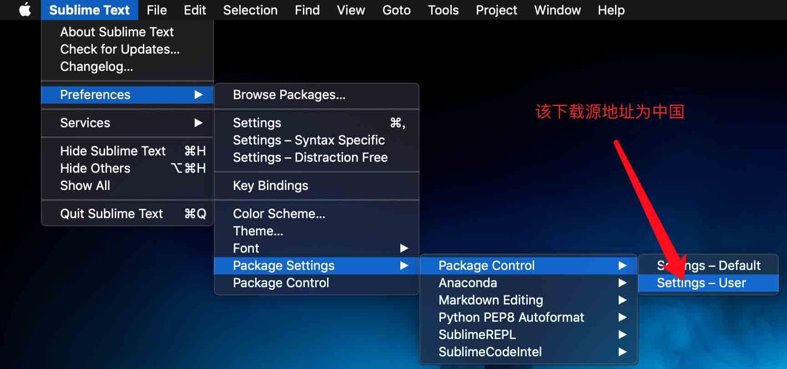

# 解决Sublime的package control被墙
主要是https://packagecontrol.io 这个被墙了 下载不下来导致的错误，把下载链接改为国内的
设置Preferences > Package Settings > Package Control > Settings - User
```
{
    "bootstrapped": true,
    "channels":
    [
        "http://cst.stu.126.net/u/json/cms/channel_v3.json"
    ],
    "in_process_packages":
    [
    ],
    "installed_packages":
    [
        "Anaconda",
        "Package Control",
        "Python PEP8 Autoformat"
    ]
}
```

